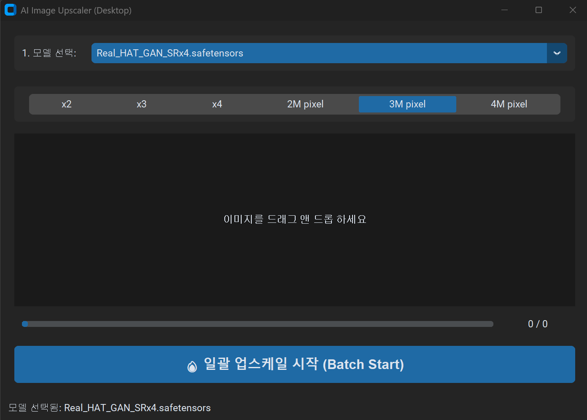

# Python AI Image Upscaler

A powerful and user-friendly image upscaling toolset that supports both **Web (Gradio)** and **Desktop (CustomTkinter)** interfaces. Powered by [spandrel](https://github.com/chaiNNER-org/spandrel), it supports a wide variety of state-of-the-art upscaling models including ESRGAN, SWINIR, HAT, and more.



## 🚀 Key Features

- **Multi-Model Support**: Use `.pth`, `.safetensors`, and `.onnx` models seamlessly.
   - **Note**: Only support fp32 onnx model. In case of fp16 model (e.g., 4xNomos8kSCHAT-L.onnx, 4xNomos8kSCHAT-S.onnx), please convert it to fp32. (using https://github.com/kirinonakar/Python_onnx, convert_fp32.py)
- **Dual Interface**:
  - **Desktop (GUI)**: Drag & Drop multiple images for fast batch processing.
  - **Web (Gradio)**: Modern web-based interface with preview capabilities.
- **Batch Processing**: Speed up your workflow by dropping dozens of images at once.
- **Flexible Scaling**: Choose between fixed ratios (`x2`, `x3`, `x4`) or target pixel counts (`2M`, `3M`, `4M` pixels).
- **Batch Background Removal**: Automatically remove image backgrounds using ONNX models (RMBG, BiRefNet, InSPyReNet).
- **32bit BMP Support**: Option to save as 32bit BMP with alpha channel (transparent background) along with standard PNG.
- **Tiling & Overlap Support**: Process high-resolution images by splitting them into tiles (256x256 or 512x512) with overlap to avoid VRAM issues and edge artifacts.
   - **Note**: In case of HAT model, 256x256 tile size is recommended due to memory limitation.
- **Auto-Save**: Processed images are automatically saved as high-quality `.png` files in the source folder with an `_upscaled` suffix.
- **CUDA Optimized**: Leverages NVIDIA GPUs for rapid inference.

## 🛠️ Prerequisites

- Python 3.10+
- NVIDIA GPU with CUDA support (Recommended)

## 📦 Installation

1. Clone the repository:
   ```bash
   git clone https://github.com/your-username/Python_upscaler.git
   cd Python_upscaler
   ```

2. Setup virtual environment:
   ```bash
   python -m venv .venv
   source .venv/Scripts/activate  # On Windows
   ```

3. Install dependencies:
   ```bash
   pip install -r .\requirements.txt
   ```

## 🚀 Usage

### Desktop Version (CustomTkinter)
The desktop version is optimized for batch processing. Simply drag and drop your image files or folders.
- Run: `run_ctk_upscaler.bat` or `python ctk_app.py`

### Web Version (Gradio)
The web version provides a clean preview and easy access from any browser.
- Run: `run_upscaler.bat` or `python app.py`

### Background Remover (CustomTkinter)
Dedicated interface for removing image backgrounds in batch.
- Run: `run_rmbg.bat` or `python rmbg_app.py`

Create or edit `model_path.txt` (for upscaler) and `rmbg_model_path.txt` (for background remover) in the root directory to specify where your model files are located.

**Example `model_path.txt` / `rmbg_model_path.txt`:**
```text
D:\Models\Upscale
```

## 📂 Project Structure

- `app.py`: The Gradio-based web application.
- `ctk_app.py`: The CustomTkinter-based desktop application.
- `rmbg_app.py`: The background removal application.
- `rmbg_engine.py`: Inference engine for background removal.
- `model_path.txt`: Configuration for upscaler model directory.
- `rmbg_model_path.txt`: Configuration for background removal model directory.
- `run_upscaler.bat`: Batch script to launch the web UI.
- `run_ctk_upscaler.bat`: Batch script to launch the desktop GUI.
- `run_rmbg.bat`: Batch script to launch the background remover GUI.

## 📜 License

This project is licensed under the MIT License - see the [LICENSE](LICENSE) file for details.

## 🙏 Credits

- [spandrel](https://github.com/chaiNNER-org/spandrel) for universal model loading.
- [CustomTkinter](https://github.com/TomSchimansky/CustomTkinter) for the modern desktop UI.
- [Gradio](https://gradio.app/) for the web interface.
